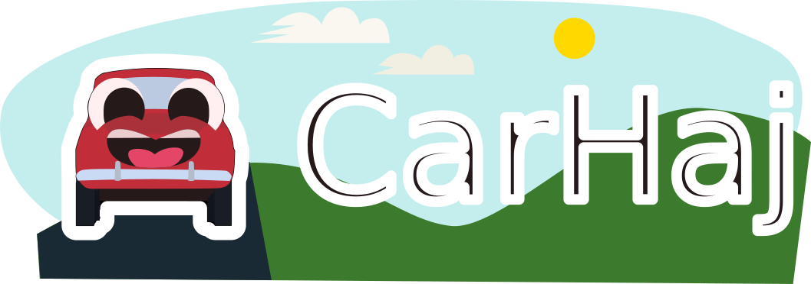

## Game
1. Show a manual page
2. Test the user on the manual page by getting them to do it
3. Have "Cupri" give funny encouragement messages, with car puns, using Google Gemini API.

4. Challenge mode where users try to do it as fast as possible?

## Work division
| Task                                                       | Who             | Status |
|------------------------------------------------------------|-----------------|--------|
| Level design                                               | Arf             |  ✅   |
| Assets                                                     | Slushee         |  ✅   |
| Godot stuff                                                | Fay (& Slushee) |  ✅   |
| Gemini integration (Tips + Success/encouragement messages) | Emma            |  ✅   |

## QTEs spec

4 lines:

 - <x (- left) y z (- forward) size>
 - option1,option2
 - \<correct option 0 indexed>
 - \<timeeout (secs)>

## How to run
If you want to run this game, please note that the attached build contains an expired Gemini cache and API key. If you want to play, you will need to generate a new Gemini API key, and cache the manual with the [script](./Scripts/Gemini/Make_Cache/uploadCache.py). You will need to make a .env before, with GEMINI_KEY defined as the Gemini API secret. This secret should also be defined in [environment.gd](./Scripts/environment.gd.example).
